# 提示词与图片画廊

这份文档整理了一份统一的基础提示词模板，以及与之对应的示例图片，方便后续扩展、替换和随机组合。

## 基础提示词模板

> 纵向 9:16，现代日式动漫风格插画，描绘一位 [角色类型] 角色，[发色与发型]，[眼睛颜色]，穿着 [服装描述]。
>
> 角色站在户外，背景是鲜艳明亮的夏日蓝天与大片柔软的白云。采用低机位时尚人像构图，主体居中，画面呈现四分之三身到全身视角，头部靠近画面上方三分之一位置，视线微微向下或看向一侧，神情平静而自信。姿态自然放松，带有含蓄的模特气质，[姿势描述]，整体身体姿态优雅。
>
> 角色需要呈现成熟、迷人、时尚且带有克制的性感气质，拥有夸张而美观的日式动漫比例、优美的身体轮廓、清晰的腰线，以及自信的时尚模特感。整体必须保持得体且非露骨，不包含色情内容，不允许裸体。
>
> 画风：高质量 2D 日式动漫插画，柔和的半厚涂赛璐璐上色，干净但略带自然草稿感的线条，轻柔的水彩式色彩过渡，柔和的阳光高光，通透的夏日空气感，平滑的肌肤表现，精致的五官，富有表现力的眼睛，以及精炼的幻想浪漫系插画氛围。整体采用明亮的蓝白色调、梦幻云层、柔和逆光、清晰对焦、高细节与优雅构图。
>
> 无文字、无水印、无 Logo、无边框、无多余角色、无手部畸形、无糟糕人体结构、无幼态外观。

## 示例 01

**角色信息**

- 角色类型：女性
- 发型：金色长波浪发
- 眼睛：绿色眼睛
- 服装：低胸蓝色泳装
- 姿势：一只手轻放在臀部附近，另一只手臂自然垂落，呈现平静的海滩模特站姿
- 关键词：女性，金色长波浪发，绿色眼睛，低胸蓝色泳装，一只手轻放在臀部附近，另一只手臂自然垂落，平静的海滩模特站姿

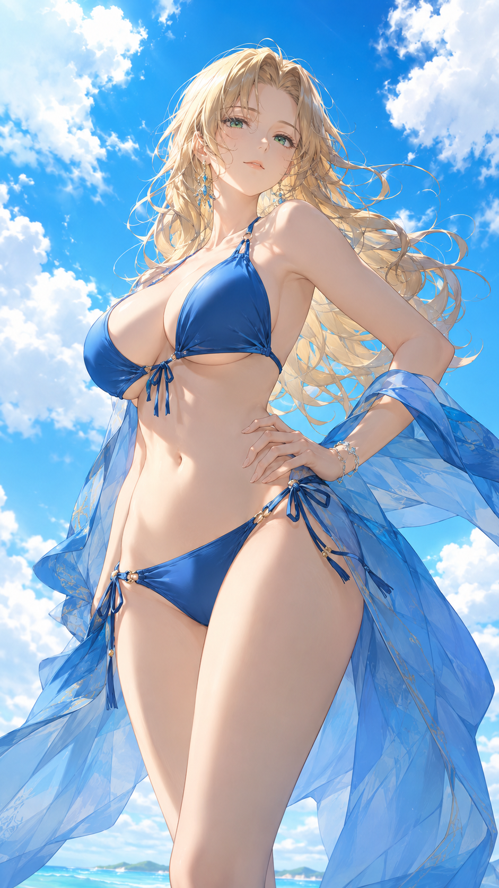

---

## 示例 02

**角色信息**

- 角色类型：奇幻女主角
- 发型：银色短波波头
- 眼睛：银色眼睛
- 服装：白色挂脖泳装，搭配金色配饰
- 姿势：一只手放在腰间附近，另一只手臂自然放松，身体微微转侧，呈现端庄的女主角站姿
- 关键词：奇幻女主角，银色短波波头，银色眼睛，白色挂脖泳装，金色配饰，一只手放在腰间附近，另一只手臂自然放松，身体微微转侧，端庄的女主角站姿

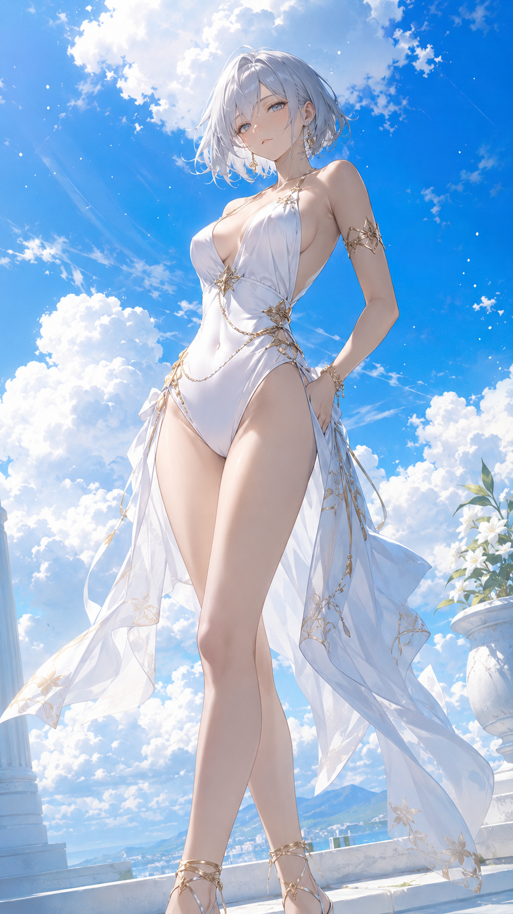

---

## 示例 03

**角色信息**

- 角色类型：自信女性
- 发型：银白色刺猬短发
- 眼睛：水蓝色眼睛
- 服装：粉色修身上衣，搭配飘逸白色迷你裙
- 姿势：一只手放在腰部附近，另一只手臂自然下垂，站姿带有自信的轻微胯部倾斜
- 关键词：自信女性，银白色刺猬短发，水蓝色眼睛，粉色修身上衣，飘逸白色迷你裙，一只手放在腰部附近，另一只手臂自然下垂，自信的轻微胯部倾斜

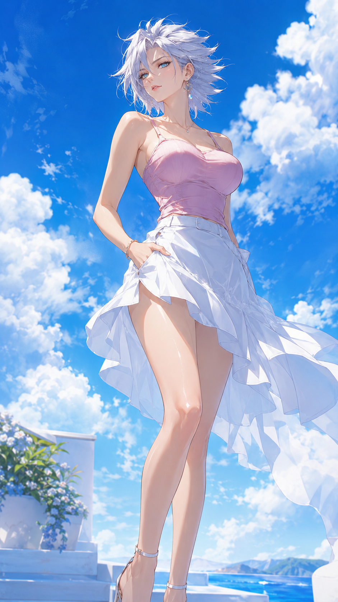

---

## 示例 04

**角色信息**

- 角色类型：女性
- 发型：红色长卷发
- 眼睛：金色眼睛
- 服装：白色夏日泳装，搭配轻薄透纱沙滩披巾
- 姿势：一只手轻轻提着透纱沙滩披巾，另一只手臂自然垂落，呈现优雅的海边站姿
- 关键词：女性，红色长卷发，金色眼睛，白色夏日泳装，轻薄透纱沙滩披巾，一只手轻轻提着透纱沙滩披巾，另一只手臂自然垂落，优雅的海边站姿

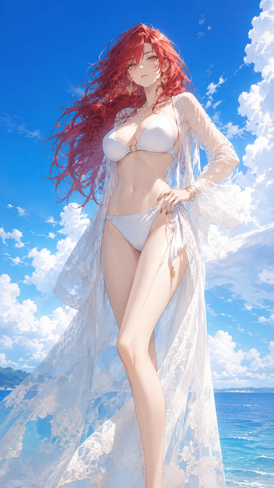

---

## 示例 05

**角色信息**

- 角色类型：女性
- 发型：棕色及肩直发
- 眼睛：灰色眼睛
- 服装：露肩粉彩连衣裙，带有丝带装饰
- 姿势：一只手轻触裙摆或丝带位置，另一只手臂自然放松，整体姿态温柔而优雅
- 关键词：女性，棕色及肩直发，灰色眼睛，露肩粉彩连衣裙，丝带装饰，一只手轻触裙摆或丝带位置，另一只手臂自然放松，温柔而优雅的姿态

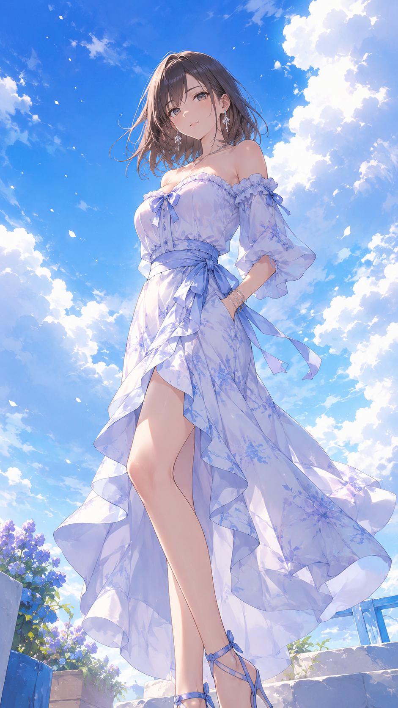

---

## 示例 06

**角色信息**

- 角色类型：女性
- 发型：粉色短波波头
- 眼睛：紫罗兰色眼睛
- 服装：红色修身露脐上衣，搭配高腰蓝色牛仔裤
- 姿势：一只手靠近腰部或大腿，另一只手臂自然放松，呈现自信的现代街头时尚站姿
- 关键词：女性，粉色短波波头，紫罗兰色眼睛，红色修身露脐上衣，高腰蓝色牛仔裤，一只手靠近腰部或大腿，另一只手臂自然放松，自信的现代街头时尚站姿

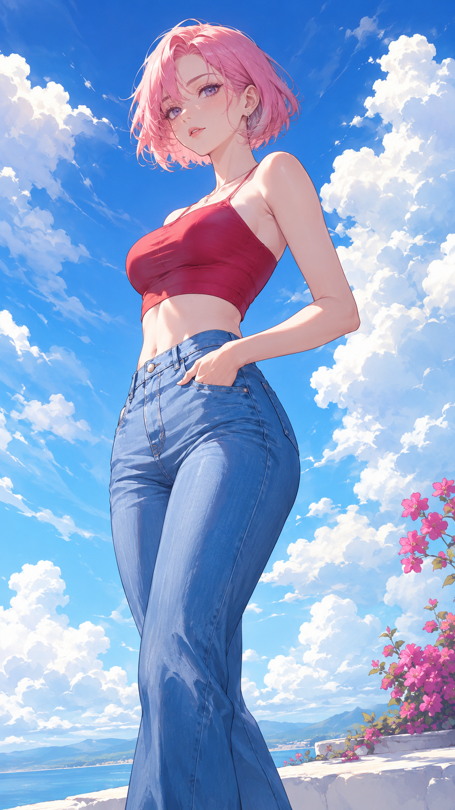

---

## 示例 07

**角色信息**

- 角色类型：男性
- 发型：青绿色凌乱短发
- 眼睛：水蓝色眼睛
- 服装：宽松白色敞开衬衫，搭配休闲夏日短裤
- 姿势：一只手臂自然垂在身侧，另一只手靠近口袋或大腿，呈现轻松的夏日休闲站姿
- 关键词：男性，青绿色凌乱短发，水蓝色眼睛，宽松白色敞开衬衫，休闲夏日短裤，一只手臂自然垂在身侧，另一只手靠近口袋或大腿，轻松的夏日休闲站姿

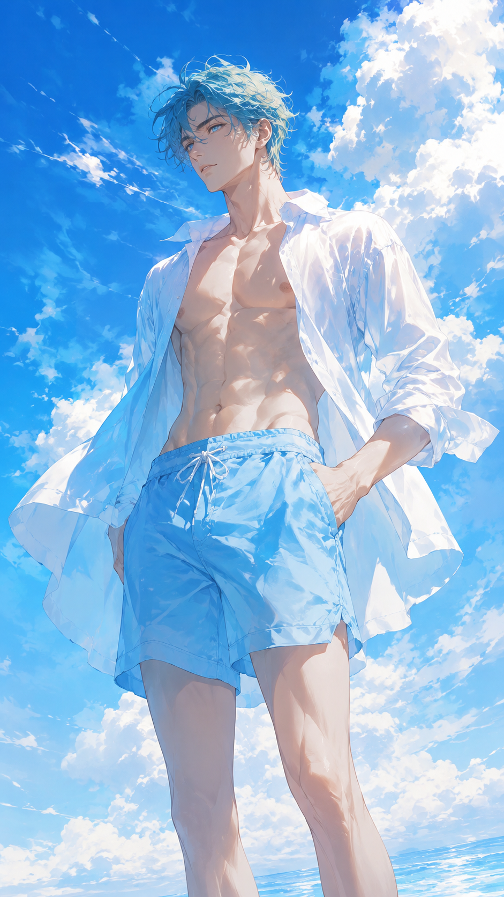

---

## 示例 08

**角色信息**

- 角色类型：女性
- 发型：金色长波浪发
- 眼睛：祖母绿眼睛
- 服装：蓝色花卉比基尼，搭配半透明白色纱裙
- 姿势：一只手轻轻提着半透明纱裙，另一只手放在腰部附近，呈现优雅的海滩度假站姿
- 关键词：女性，金色长波浪发，祖母绿眼睛，蓝色花卉比基尼，半透明白色纱裙，一只手轻轻提着半透明纱裙，另一只手放在腰部附近，优雅的海滩度假站姿

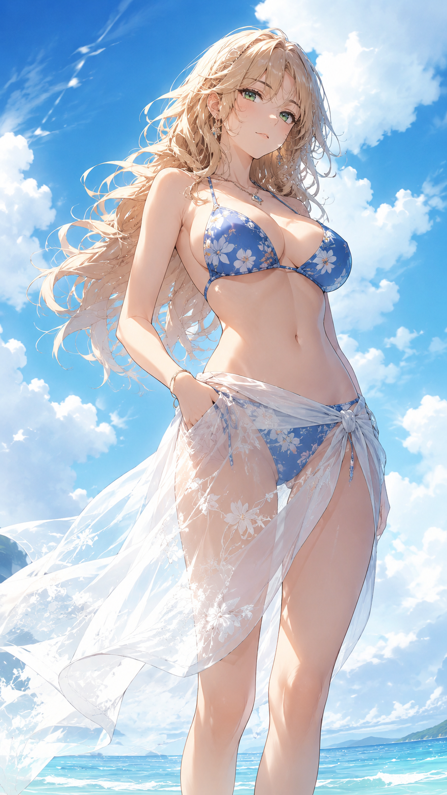

---

## 示例 09

**角色信息**

- 角色类型：精致的度假美人
- 发型：浅灰棕色海边慵懒波浪发
- 眼睛：琥珀色眼睛
- 服装：海绿色比基尼，搭配柔软透明裹裙
- 姿势：一只手轻轻提起透明裹裙，另一只手自然垂放在胯侧
- 关键词：精致的度假美人，浅灰棕色海边慵懒波浪发，琥珀色眼睛，海绿色比基尼，柔软透明裹裙，一只手轻轻提起透明裹裙，另一只手自然垂放在胯侧

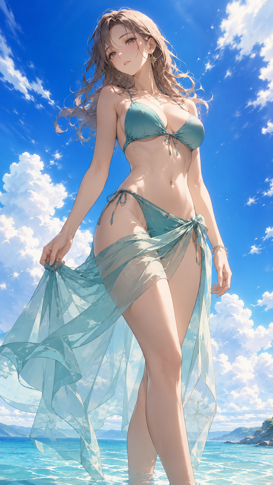

---

## 示例 10

**角色信息**

- 角色类型：高贵淑女
- 发型：深红棕色层次长发
- 眼睛：酒红色眼睛
- 服装：酒红色鱼尾礼服，配蕾丝袖与修身剪裁
- 姿势：身体微微转侧，呈现柔和的 S 曲线与轻微胯部倾斜，一只手可放在腰间、轻触头发或服装，或自然垂在大腿附近，另一只手臂保持放松，双腿自然错步或微微弯曲
- 关键词：高贵淑女，深红棕色层次长发，酒红色眼睛，酒红色鱼尾礼服，蕾丝袖，修身剪裁，身体微微转侧，柔和的 S 曲线，轻微胯部倾斜，一只手靠近腰间或头发，双腿自然错步

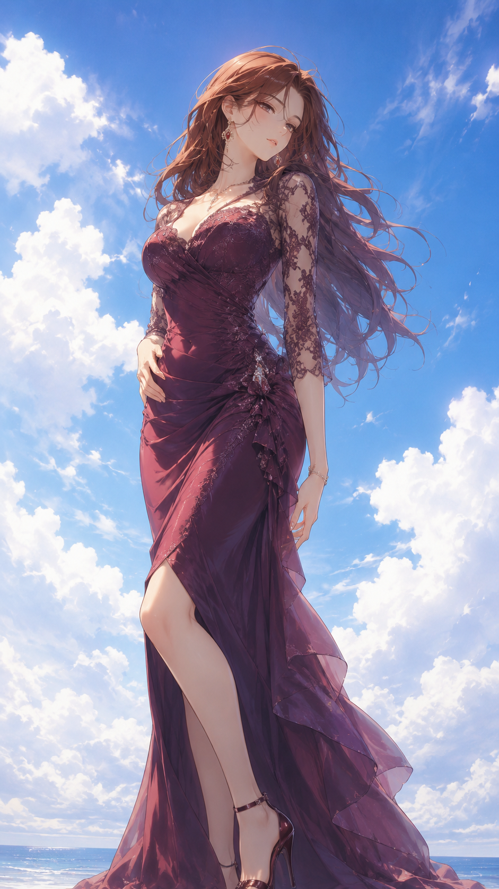

---

## 示例 11

**角色信息**

- 角色类型：华丽佳人
- 发型：富有光泽的银金色头发
- 眼睛：蓝色眼睛
- 服装：银灰色晚礼服，配水晶刺绣与柔软披肩
- 姿势：身体微微转侧，呈现柔和的 S 曲线与轻微胯部倾斜，一只手可放在腰间、轻触头发或服装，或自然垂在大腿附近，另一只手臂保持放松，双腿自然错步或微微弯曲
- 关键词：华丽佳人，富有光泽的银金色头发，蓝色眼睛，银灰色晚礼服，水晶刺绣，柔软披肩，身体微微转侧，柔和的 S 曲线，轻微胯部倾斜，双腿自然错步

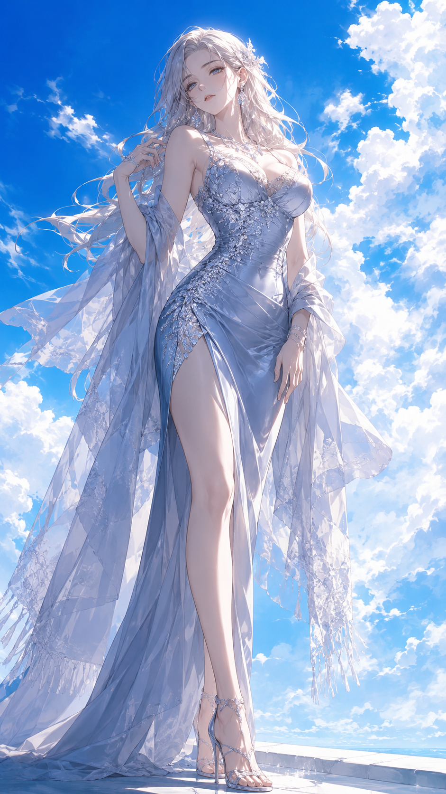

---

## 示例 12

**角色信息**

- 角色类型：柔美优雅的女性
- 发型：珍珠白色头发，带有柔和侧编发
- 眼睛：烟灰蓝色眼睛
- 服装：薰衣草色露肩连衣裙，搭配柔和的丝带腰饰
- 姿势：身体微微转侧，呈现柔和的 S 曲线与轻微胯部倾斜，一只手可放在腰间、轻触头发或服装，或自然垂在大腿附近，另一只手臂保持放松，双腿自然错步或微微弯曲
- 关键词：柔美优雅的女性，珍珠白色头发，柔和侧编发，烟灰蓝色眼睛，薰衣草色露肩连衣裙，柔和的丝带腰饰，身体微微转侧，柔和的 S 曲线，轻微胯部倾斜，双腿自然错步

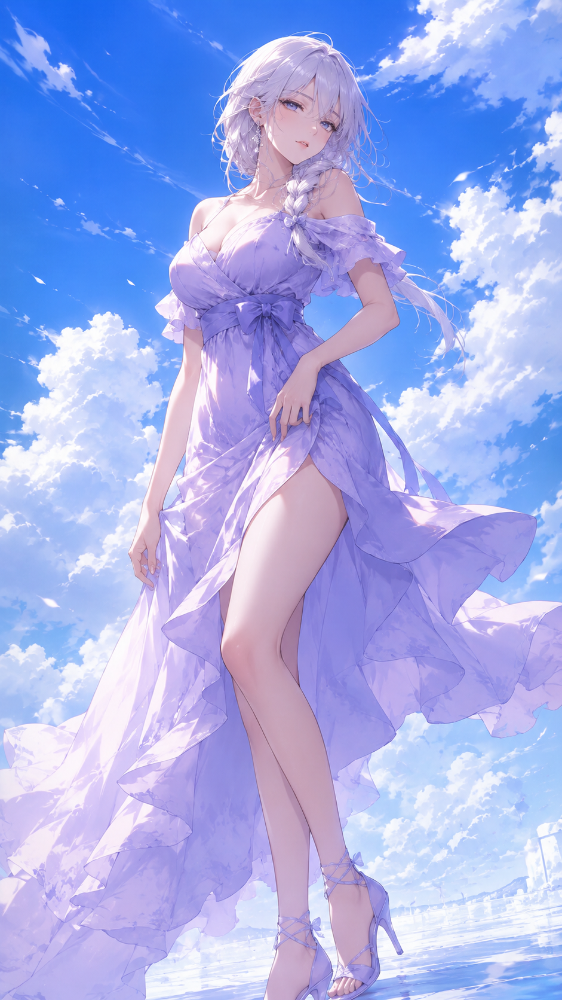

---

## 示例 13

**角色信息**

- 角色类型：温柔的奇幻女性
- 发型：带有柔和波浪的珍珠金色长发
- 眼睛：宝石般的祖母绿眼睛
- 服装：白色度假风长裙，搭配柔软半透明罩层
- 姿势：一只手轻轻提起前侧裙摆，另一只手臂自然垂在身侧，姿态轻盈从容
- 关键词：温柔的奇幻女性，带有柔和波浪的珍珠金色长发，宝石般的祖母绿眼睛，白色度假风长裙，柔软半透明罩层，一只手轻轻提起前侧裙摆，另一只手臂自然垂在身侧

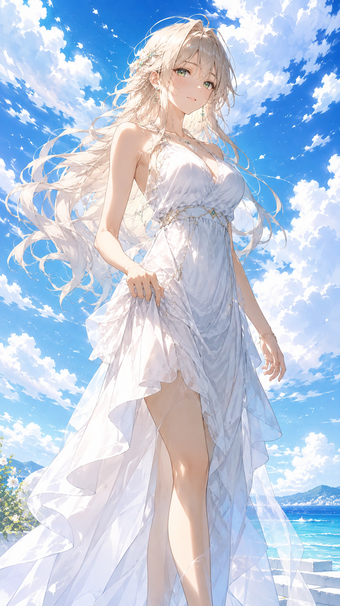

---

## 示例 14

**角色信息**

- 角色类型：清冷高雅的女性
- 发型：灰褐色及肩直发
- 眼睛：浅紫水晶色眼睛
- 服装：柔和银色连衣裙，带有利落的收腰设计
- 姿势：一只手松弛地收在腰前，另一只手臂自然贴身放松，整体轮廓干净而端庄
- 关键词：清冷高雅的女性，灰褐色及肩直发，浅紫水晶色眼睛，柔和银色连衣裙，利落的收腰设计，一只手松弛地收在腰前，另一只手臂自然贴身放松，轮廓干净端庄

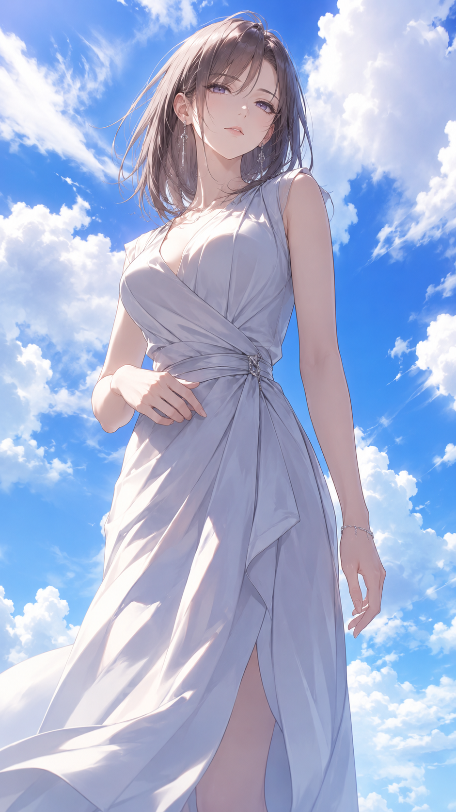

---

## 示例 15

**角色信息**

- 角色类型：高不可攀的美人
- 发型：带有沉静光泽的珍珠黑色长发
- 眼睛：冷银灰色眼睛
- 服装：白色雪纺连衣裙，带有轻透层叠裙片
- 姿势：一只手放在下腰前方，另一只手臂自然下垂，肩部平静而稳定
- 关键词：高不可攀的美人，带有沉静光泽的珍珠黑色长发，冷银灰色眼睛，白色雪纺连衣裙，轻透层叠裙片，一只手放在下腰前方，另一只手臂自然下垂，肩部平静稳定

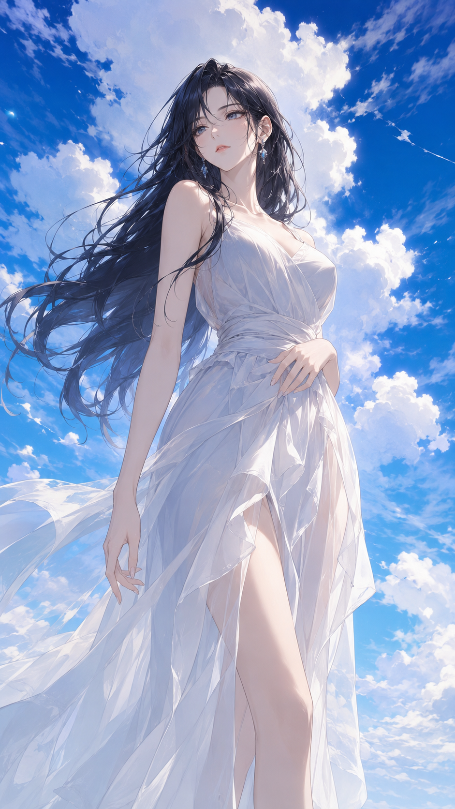

---

## 示例 16

**角色信息**

- 角色类型：成熟的海边女性
- 发型：高马尾，带有在风中飞舞的散落发丝
- 眼睛：水晶蓝色眼睛
- 服装：浅蓝色泳装，搭配轻透蕾丝罩衣
- 姿势：一只手在身侧拿着海边草帽，另一只手臂自然放松，呈现自信的海边站姿
- 关键词：成熟的海边女性，高马尾，带有在风中飞舞的散落发丝，水晶蓝色眼睛，浅蓝色泳装，轻透蕾丝罩衣，一只手在身侧拿着海边草帽，另一只手臂自然放松，自信的海边站姿

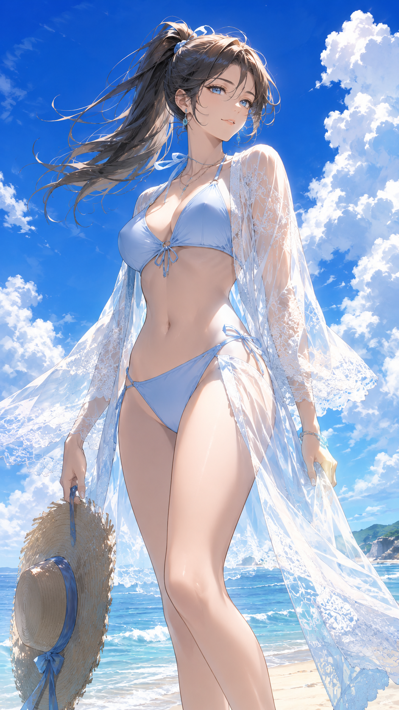

---

## 示例 17

**角色信息**

- 角色类型：优雅的海滩女士
- 发型：在海风中摆动的金色长波浪发
- 眼睛：清澈的天蓝色眼睛
- 服装：香槟色泳装，搭配轻薄度假风罩袍
- 姿势：一只手放在腰间，另一只手轻轻捏着披肩边缘
- 关键词：优雅的海滩女士，在海风中摆动的金色长波浪发，清澈的天蓝色眼睛，香槟色泳装，轻薄度假风罩袍，一只手放在腰间，另一只手轻轻捏着披肩边缘

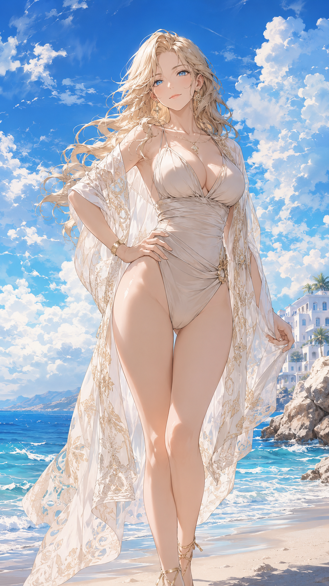

---

## 示例 18

**角色信息**

- 角色类型：成熟度假模特
- 发型：带有轻盈空气感的银色短波波头
- 眼睛：琥珀色眼睛
- 服装：香槟色泳装，搭配轻薄度假风罩袍
- 姿势：一只手轻提纱裙边缘，另一只手轻触太阳穴附近的头发
- 关键词：成熟度假模特，带有轻盈空气感的银色短波波头，琥珀色眼睛，香槟色泳装，轻薄度假风罩袍，一只手轻提纱裙边缘，另一只手轻触太阳穴附近的头发

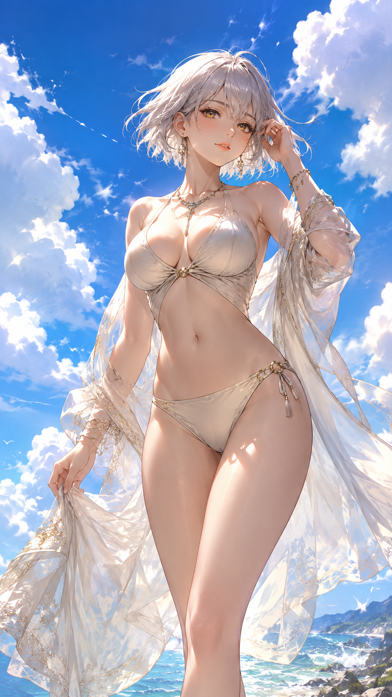
